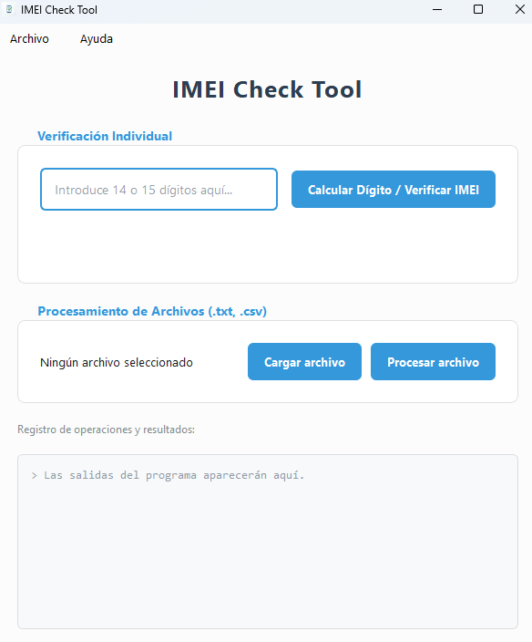

# 📌 Imei_Check_Tool version Alpha

Aplicación para verificar números IMEI y sus dígitos de control





## 🧠 Descripción

IMEI Control Tool es una aplicación de escritorio desarrollada en Python con PyQt que permite verificar, generar y autocompletar el dígito de control de números IMEI utilizando el algoritmo de Luhn.

La aplicación permite trabajar tanto con IMEIs individuales como con archivos completos en formato TXT o CSV, facilitando el procesamiento masivo de números IMEI de forma rápida y segura.

## 🚀 Empezando

Estas instrucciones te guiarán para obtener una copia de este proyecto en funcionamiento en tu máquina local.

### 📋 Prerrequisitos
- Sistema Operativo: Windows 11
- Lenguaje de programación: Python 3.14.2


### 🔧 Instalación

```bash
# Paso 1: Clonar el repositorio
git clone https://github.com/noclastic/imei_check_tool.git
cd project

# Paso 2: Crear entorno virtual (opcional)
python -m venv venv
source venv/bin/activate  # En Windows: venv\Scripts\activate

# Paso 3: Instalar dependencias
pip install -r requirements.txt


# Paso 4: Ejecutar la aplicación
python imei_check_tool.py
```

---


## 🛠️ Construido Con

- [Python](https://www.python.org/) - Lenguaje de programación

---

## 🖇️ Contribuyendo

Las contribuciones son lo que hacen a la comunidad de código abierto un lugar increíble para aprender, inspirar y crear. ¡Cualquier aporte es bienvenido!

```md
1. Haz fork del repositorio
2. Crea una rama (`git checkout -b feature/NuevaCaracterística`)
3. Commit de tus cambios (`git commit -m 'Agrega nueva característica'`)
4. Push a tu rama (`git push origin feature/NuevaCaracterística`)
5. Abre un Pull Request
```


## 🛟 Soporte

Si tienes algún problema o sugerencia, por favor abre un issue [aquí](https://github.com/noclastic/imei_check_tool/issues).

---

## 📌 Versionado

Usamos [Git](https://git-scm.com) para el control de versiones y seguimos [Semantic Versioning](https://semver.org/).


---

## ✒️ Autores

- **Roberto Getino** - [Roberto Getino](https://github.com/noclastic)

---

## 📄 Licencia

Este proyecto está bajo la Licencia MIT

---

## ❤️ Apóyanos

Si te gusta este proyecto y deseas apoyar su desarrollo, puedes hacerlo aquí:

- [GitHub Sponsors](https://github.com/sponsors/noclastic)

---

## ☕ Puedes invitar al equipo a café

Si te gusta el proyecto y quieres apoyar al equipo de desarrollo, puedes invitarnos a un café enviando una pequeña donacion en cripto ❤️

💰 Cryptocurrency donations

₿ Bitcoin (BTC)
bc1qk822w8nnlrfuayue5444dccuhgmrhapvc42z4l

Ξ Ethereum (ETH)
0x443Eff349233EfF7C0A40703B39768d9f88A453b

Ł Litecoin (LTC)
ltc1qlzca6f39sxe4xpm6cmx0y04zahncltuxu058xp

₮ Tether (USDT)
0x443Eff349233EfF7C0A40703B39768d9f88A453b

◎ Solana (SOL)
5x8qWPUuDLYvdr6CSAKVG6HBY4T3miyF2MjxfyKTwe5B

Gracias por apoyar el proyecto! ☕🚀

---

## 🎁 Agradecimientos

Estamos agradecidos por las contribuciones de la comunidad a este proyecto. Si encontraste valor en este trabajo, puedes:

- Compartir el proyecto 📤
- Invitarnos un café ☕
- Iniciar un issue o PR 🙌
- Dejar tu agradecimiento con un comentario 💬

---

⌨️ con ❤️ por [Roberto Getino](https://github.com/noclastic)